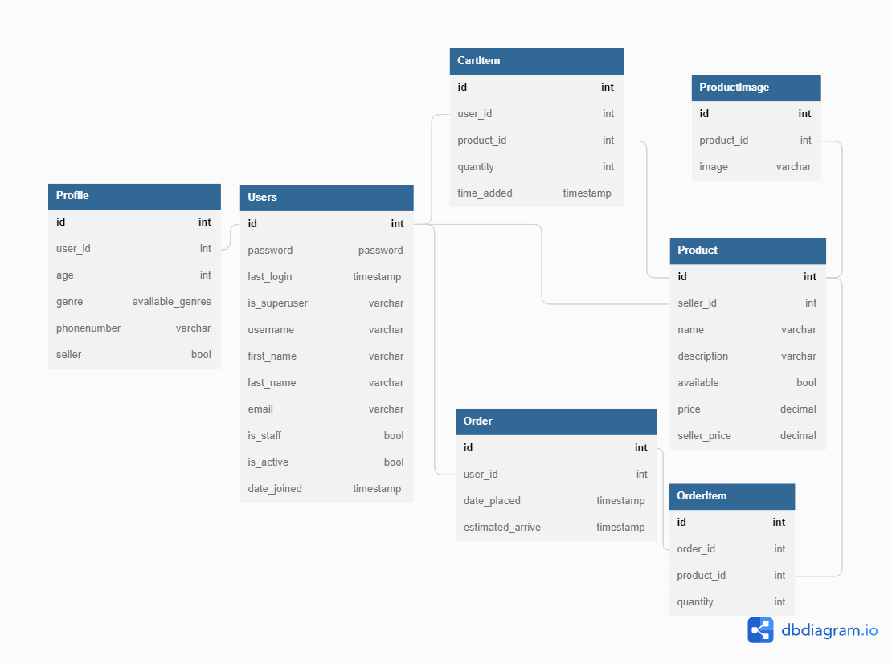

# Title: Rubberduck groceries store (MVP)
---
## Overview
This will be a customer to customer (c2c) e-commerce of pets.

Mainly focused in the cart part and users creation. It also contains the
inventory managment.

### Scope
Basic user authentication and inventory management. Mainly focused in the cart feature.

#### Use cases
Customer to customer service, there will be two kind of users, regular
user, seller user. The seller user is a regular user with more permissions.

 - [x] Sign up. A user registers to the site with email, username, password,
name, phonenumber, age, gender, and wether the user wants to sell or only
consume.
 - [x] It is not necessary to be loged in to see all the available products.
 - [x] It is necessary to be authenticated to add products to the cart.
 - [x] The size of the pagination can be changed for 10, 20, or 30 products
per page.
 - [x] Sign in. A user authenticates with its username and password and
receives a JWT token to sign all its requests that add or modify data.
 - [x] A regular user does not have permission to add or modify products for
sell.
 - [x] A seller user cannot modify products that are not owned (sold) by
that user.
 - [x] All the products that have stock=0 and that are not sold by the current
user wont be returned by the API.
 - [x] Only a seller can see products that he/she sells that have 0 existencies.
 - [x] The user can search for a product with string. Uses search as query_param.
 - [ ] A seller user can also buy.
 - [ ] A regular user and a seller user can add, modify and delete products
of his/her cart.
 - [ ] The user cannot add more items to the cart than what is available.
 - [ ] The user cannot set the quantity of a product in the cart to 0 or less.
If user attempts to do this the item is deleted from the cart.
 - [ ] A seller user can see a register of all the completed purchases of his/her
products.

#### Out of Scope
This is an MVP therefore some features that would be nice to have in an
ecoommerce are not implemented. A few of them are

 - [ ] Track of orders is not implemented
 - [ ] Out of stock alerts are not implemented
 - [ ] A real payment API is not consumed. Options are stripe.
 - [ ] Recomendations of products to the user.

---
## Arquitecture (To be Updated)

### Diagrams
poner diagramas de secuencia, uml, etc

### Data models

[](https://mermaid.live/edit#pako:eNqNVM1u2zAMfhVB5_YFfN126KkDht0CCLRF29xkyZXoDkGSd69k2V6sJFt9MKiPFH8-kjrJxmmUlUT_laDzMBysiN_PgD6IUz6QZUE6y4E92U6MEMIf5xdQAyPTgMJAYGVcRzYraueMoKDCNKKfos-dkwRYGHAHtuSjjxt49nyD4gBkilAMbbuHoGF6xyLVJKhfjiwuRVwOS9LfvdNTw-J8fn4-n9bjywAdikpoDI2nGrWqj8WNbHKHtCSP2Uat2AjcC0o3ivCJ-jX2q9fxUEXjdC3rM_YgSqJ0CzGXOBpoUItUc6RmGLMqyjE2xyrA-0hOqb_sor0wDmVKjbMMZMNdzv7eioZgVY0qjUTp8kERLhmof5GXsLcJLBMfb7vXksGcyXlmsxI9hFL_GQITsDVoGbkOrd8jY-8s2mmo1_Ge5y6gMStwt7crZdVsOue35_JBhtmxKhbyZjXynI5M7noX4T0uDNRm3QZs4hiYyC81BbSEudLcreILeL5qdA_rohUTUdjtBmLTfbYn_x-Hbc3TT4HW25bLJzmgj--Gjq_eHPAgucfInqyiqMH_PsiDTXbTmNx808TOy6oFE_BJwsTux9E2smI_4Wq0PJ6L1eUD13HJzw)

---
## Limitations
Some technologies constraints and utilities required for the design.

<!--
Ej.
* Llamadas del API tienen latencia X
* No se soporta mas de X llamadas por segundo
-->

### Technologies
 - [x] Docker
 - [x] Django
 - [x] Django REST framework

### Utilities
 - [x] Fixtures
 - [ ] Unit tests
 - [ ] Migrations
 - [ ] Custom commands

<!--
---
## Costo
Descripción/Análisis de costos
Ejemplo:
"Considerando N usuarios diarios, M llamadas a X servicio/baseDatos/etc"
* 1000 llamadas diarias a serverless functions. $XX.XX
* 1000 read/write units diarias a X Database on-demand. $XX.XX
Total: $xx.xx (al mes/dia/año)
-->
